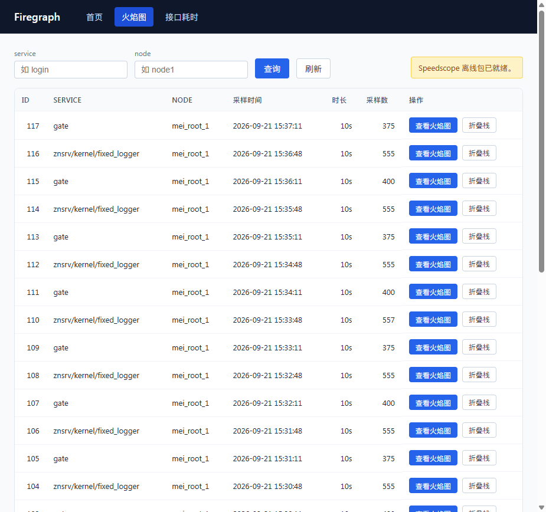
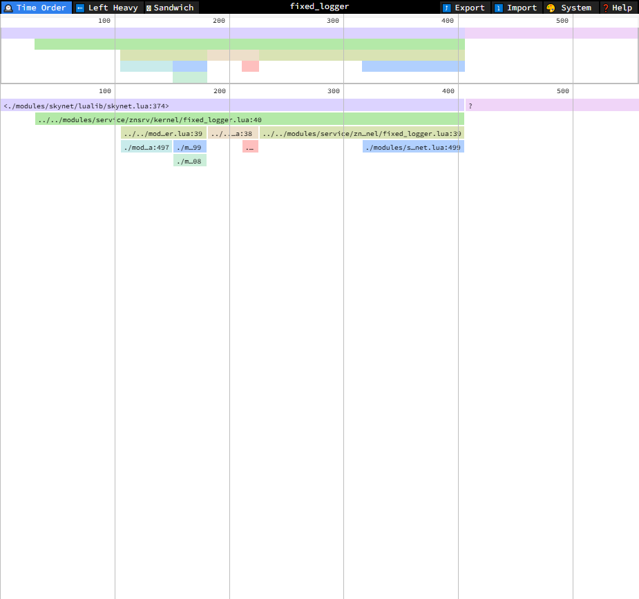
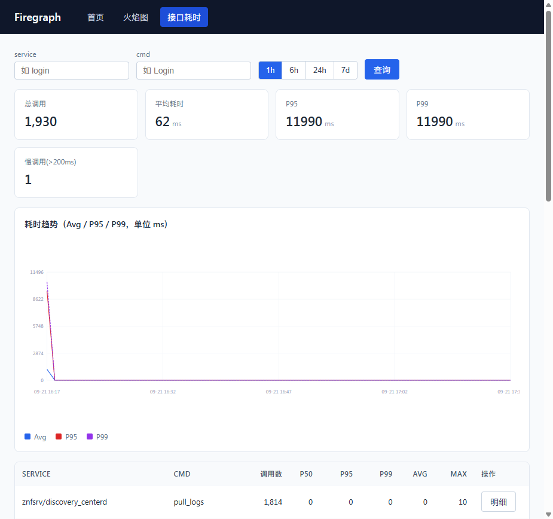

# Firegraph

面向 **Skynet + Lua** 游戏服务器的性能监测平台，提供两大能力：

- **CPU 火焰图**：运行时对每个 snlua 服务做 Lua 调用栈采样，浏览器内用 [speedscope](https://github.com/jlfwong/speedscope) 交互查看，实时刷新、支持暂停/继续与保存文件。
- **接口耗时统计**：在 `skynet.dispatch` 层无侵入埋点，记录每条消息处理耗时，聚合出 P50/P95/P99 分位与趋势图。

当前方案**无独立后端**（不需要 Go/Python/静态文件服务器），全部由 [swt](https://github.com/lsg2020/swt) 的 agent 服务内置 HTTP/WebSocket 承载，火焰图页面与接口耗时页面直接内嵌在 swt agent 中。

## 效果截图

### 火焰图

火焰图列表页（按 service / node 筛选，实时追加新采样）：



点击「查看火焰图」后，进入 speedscope 实时火焰图（可暂停/继续、保存折叠栈文件）：



### 接口耗时

接口耗时页（P50/P95/P99 分位 + 趋势图 + 慢接口高亮）：



## 架构

```
每个 snlua 服务（gate / login / zone / center ... 各自独立 Lua VM）
   │
   ├─ firegraph.monitor → debug.sethook 调用栈采样
   │     （monkey-patch skynet.start + coroutine.create/wrap，跨协程、跨服务采样）
   │     └─ 周期生成 folded stack → skynet.send(swt/agent, "fg_profile", ...)
   │
   └─ firegraph.tracer  → 包装 skynet.dispatch 记录消息耗时代价
         └─ 批量 skynet.send(swt/agent, "fg_traces", ...)
                    │
                    ▼
        swt/agent 服务（handle_firegraph.lua）
           ├─ 内存缓存 profile / traces（无落盘）
           ├─ HTTP 路由：/firegraph、/firegraph/view、/traces.html、/api/*
           ├─ WebSocket 实时推送新 profile
           └─ speedscope 静态资源服务 + folded.collapsedstack.txt 生成
                    │
                    ▼
              浏览器（火焰图 + 接口耗时，实时刷新）
```

关键点：

- **无后端**：不依赖 `firegraph` 的 Go 服务，由 SWT agent 内置 HTTP/WebSocket 承载。
- **跨 snlua 采样**：通过 monkey-patch 让每一个 snlua 实例独立采样上报，而不是只采样 launcher。
- **纯 Lua 采样**：用 `debug.sethook` 替代 SWT 原生 `profile.so`（后者与部分 skynet 分支的 ABI 不兼容）。

## 整合包目录

可无缝迁移到其他同类 skynet 项目的服务端材料，位于 `skynet/`：

```
skynet/
├── lualib/
│   ├── firegraph/         # 核心模块：init / monitor / tracer / reporter / swt_bridge
│   ├── swt/               # SWT Lua 库：init / http_helper / util / debug / ws_client
│   ├── http/              # skynet http 扩展（websocket / sockethelper 等，标准 skynet 常缺）
│   └── router.lua         # HTTP 路由
├── service/swt/
│   ├── agent/             # main.lua + handle_firegraph.lua（后端核心，内嵌 HTML/CSS/JS）
│   └── master/            # （当前方案未启用，保留）
├── appmod/
│   ├── firegraph_boot.lua # 启动引导（在 zn.startup_app 末尾调用）
│   └── dev_preload.lua    # 开发 preload（加载 monitor/tracer，覆盖所有 snlua）
├── luaclib/
│   ├── cjson.so           # 必需
│   └── profile.so         # 已废弃（debug.sethook 取代）
├── config/
│   └── mei_common.path.example.lua  # 配置改动样例
└── MIGRATION.md           # 迁移使用文档（详见）
```

> 前端源文件在 `web/`，speedscope 离线资源在 `web/assets/vendor/speedscope/`。

## 接入方式

完整迁移步骤见 [`skynet/MIGRATION.md`](skynet/MIGRATION.md)，核心 6 步：

1. 拷贝 `skynet/lualib/`、`skynet/service/swt/`、`skynet/appmod/`、`skynet/luaclib/` 到目标项目对应目录。
2. 修改 config：`lua_path` / `luaservice` / `preload` 指向上述路径。
3. 在目标项目每个 `app/xxx/main.lua` 的 `zn.startup_app` 回调末尾加 `require("appmod.firegraph_boot")()`。
4. 把 speedscope 离线资源放到 `handle_firegraph.lua` 可识别的目录。
5. 通过 env `swt_agent_port`（默认 `9528`）配置端口。
6. 启动后访问验证。

> ⚠ 注意：Firegraph/SWT 的初始化必须在 `zn.startup_app` 回调里做，**不能在 preload 阶段**调用 `skynet.error/init` 或 `require` swt/firegraph（`znf/preload.lua` 为加密文件，会静默失败）。

## 访问地址与路由

默认 `http://127.0.0.1:9528/`：

| 路径 | 说明 |
|------|------|
| `/` | 首页 |
| `/firegraph` | 火焰图列表页 |
| `/firegraph/view?pid=..&service=..` | 实时火焰图查看（暂停/继续、保存文件） |
| `/traces.html` | 接口耗时页 |
| `/healthz` | 健康检查（返回 `{"ok":true}`） |
| `/api/profiles` | profile 列表（query: `service`、`node`、`limit`） |
| `/api/profiles/:pid/speedscope.json` | speedscope JSON |
| `/api/profiles/:pid/folded.collapsedstack.txt` | 折叠栈文本（speedscope 直接导入） |
| `/api/traces/stats` | 接口耗时聚合（count / p50 / p95 / p99 / avg / max） |
| `/api/traces/timeseries` | 时间序列（query: `bucket_sec`） |
| `/api/traces` | 接口耗时明细 |

## 折叠栈格式

每行一条调用栈，栈底在前，空格分隔采样计数（兼容 FlameGraph.pl 与 speedscope）：

```
main;skynet.dispatch;login_handler;check_token 50
main;skynet.dispatch;login_handler;db_query 150
```

## 常见问题

| 问题 | 原因 | 解决 |
|------|------|------|
| preload 后服务不启动 | 在 preload 阶段调用了 `skynet.error/init` 或 `require` swt/firegraph | 只保留 `dev_preload.lua` 的 os.time 重写 + `require "znf/preload"` + `pcall` 加载 |
| 火焰图/接口耗时页空白或一直转圈 | 浏览器复用已关闭的 HTTP 连接，`app.js` 加载失败 | HTTP 响应头加 `Connection: close`；硬刷新 Ctrl+F5 |
| 火焰图无业务调用栈 | 仅采样了 launcher snlua | 确认 `monitor.lua` 已 monkey-patch `skynet.start` + 协程 |
| `service` 字段全为 `unknown` | 使用了未设置的 `skynet.getenv("service_name")` | 改用全局变量 `SERVICE_NAME`（由 skynet `loader.lua` 设置） |
| speedscope 报 inflate 错误 | 走了 JSON 导入的 gzip 解压分支 | 使用 `.collapsedstack.txt` 折叠栈文本 |
| `profile.so` 段错误 | 与目标 skynet ABI 不匹配 | 使用 `debug.sethook` 纯 Lua 采样 |
| 同一 node 多条几乎同时的 profile | 每个 snlua 服务独立采样上报（正常） | 按 `service_name` 区分 |

## License

MIT